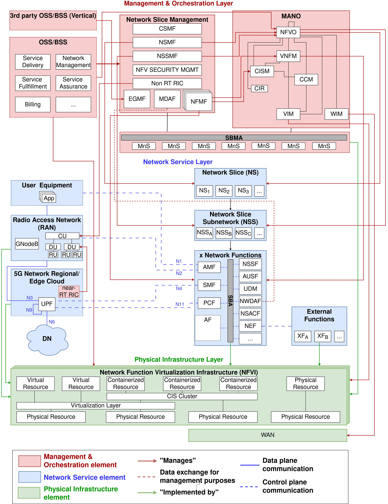

# 5G-Service-Architecture-Model
Rolling Drawio diagram of a 5G Service Oriented Architectural Model. The diagram can be visualized with [Draw.io](https://www.drawio.com/blog/edit-diagrams-with-github-dev)

 

## Goal

This work aims at depicting an E2E model being fully compliant with 3GPP Release 17 standardization framework and able to integrate novel directives provided by main standardization organizations and industry alliances, to flexibly adapt to future "Beyond 5G" network instances.

## Architecture description

The model consists of three interacting layers whose constituting elements are here indicated.

### Management & Orchestration Layer
This layer describes all the management functions needed for converting service requirements posed by the OSS/BSS, along with vertical operators, into a set of slices and manage both their deployment and evolution.
- **OSS/BSS**: Operation Support System / Business Support System functions have full end-to-end visibility of the 5G infrastructure and the services provided toward this former. They coordinate other management and orchestration functionalities.

- **Network Slice Management**: NSM represents the set of functions responsible for the management (including lifecycle) of Network Slices, Slice Subnets and Network Functions (See [[1]](#1) , [[2]](#2) , [[3]](#3))
    - *CSMF*: Communication Service Management Function;
    - *NSMF*: Network Slice Management Function;
    - *NSSMF*: Network Slice Subnet management Function;
    - *EGMF*: Exposure Governance Management Function;
    - *MDAF*: Management Data Analytics Function;
    - *NFMF*: Network Function Management Function;
    - *NFV Security Management*: logical functional block for overall security management;
    - *Non RT RIC*: non Real-Time RAN Intelligent Controller.

- **NFV-MANO**: Network Functions Virtualization, Management and Orchestration is an architectural framework for deploying and orchestrating virtualized network functions (VNFs) and other software components proposed by ETSI (See [[4]](#4), [[5]](#5)).
    - *NFVO*: Network Function Virtualization Orchestrator;
    - *VNFM* Virtual Network Function Manager;
    - *CISM*: Container Infrastructure Service Manager;
    - *CCM*: CIS Cluster Management;
    - *CIR*: Container Image Registry;
    - *VIM*: Virtualised Infrastructure Manager;
    - *WIM*: Wide area network Infrastructure Manager.

- **SBMA**: Service Based Management Architecture is an architectural model that defines basic Management Services (MnS) and a  model-driven approach for consumer/producer interaction between them in order to create Management Functions (MnF) (See [[3]](#3)).

### Network Service Layer
The slices put into operation and the network functions deployed to implement them are characterized here, highlighting the interfaces and the nature of exchanged data.

- **UE**: User Equipment

- **RAN**: Radio Access Network, with GNodeB and its possible decomposition, in particular O-RAN solution 

- **Regional/Edge Cloud**: they are resource infrastructures placed relatively close to the RAN (Regional) or even at the boundaries with it (Edge).

- **near-RT RIC**: near Real-Time RAN Intelligent Controller [[2]](#2).

- **DN**: Data Network

- **Network Slice**: a logical network that provides specific network capabilities and
network characteristics [[1]](#1)

- **Network Slice Subnetwork**: a group of network functions (including their
corresponding resources) that form part or complete constituents of a network slice [[1]](#1)

- **xNFs**: (x) Network Functions according to 3GPP Release 17 (See [[6]](#6));

### Physical Infrastructure Layer
The last layer characterizes the physical resources available in any segment of the E2E network and the virtualization facilities used to create the necessary network functions.

- **NFVI** : Network Function Virtualization Infrastructure (See [[4]](#4)).

    - *Physical Resource*: any resource provided as physical appliance;
    - *Containerized Resource*: any resource provided as a container;
    - *Virtual Resource*: any resource provided as a Virtual Machine;
    - *Virtualization Layer*:  A layer providing VM virtualization functionalities;
    - *CIS Cluster*: Container Infrastructure Service Cluster, providing container-based virtualization functionalities.

- **WAN**: Wide Area Network

# Acknowledgements

This work is partially supported by project SERICS (PE00000014) under the NRRP MUR program funded by the EU - NGEU.

# References
<a id="1">[1]</a> 
Marinos, L. Patseas et al., 
“ENISA: threat landscape for 5g networks,” 
European Agency for Cybersecurity, 2020.

<a id="2">[2]</a>
M. Polese, L. Bonati et al., 
“Understanding o-ran: Architecture, interfaces, algorithms, security, and research challenges,” 
IEEE Communications Surveys & Tutorials, vol. 25, no. 2, 2023.

<a id="3">[3]</a>
3GPP, 
“TS 28.533, management and orchestration; architecture framework, v17.4.0,” 
2023

<a id="4">[4]</a>
ETSI, 
“GS NFV 006, Network Functions Virtualisation (NFV) Release 4; Management and Orchestration; Architectural Framework Specification, v4.4.1,” 
2022.

<a id="5">[5]</a>
ETSI, 
“GR NFV-IFA 039, network functions virtualisation (nfv) release 5; architectural framework , v17.4.0,” 
2023

<a id="6">[6]</a>
3GPP, 
“TS 23.501, system architecture for the 5g system (5gs), v17.11.0,” 
2023
